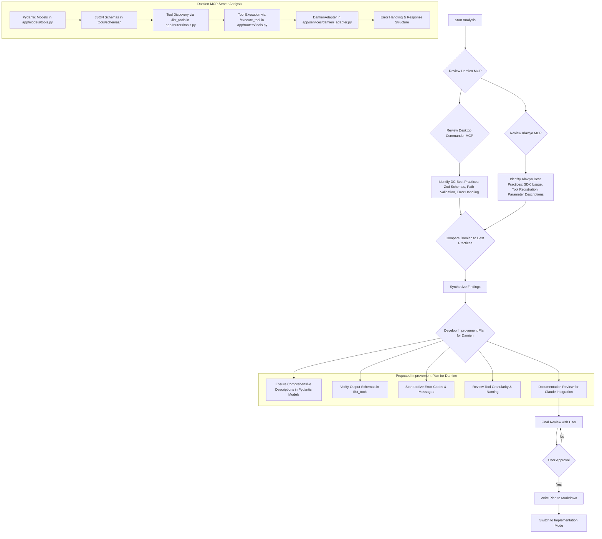

# Damien MCP Server Optimization Plan for Claude Integration

## 1. Introduction and Goal

This document outlines the analysis of the Damien CLI and MCP Server, with comparisons to the Desktop-Commander and Klaviyo-MCP applications. The primary goal is to identify optimal next steps to ensure Damien's MCP tools are robust, easily discoverable, and intuitive for Claude to use, mirroring the positive interaction patterns observed in the reference applications.

## 2. Reference Application Analysis Summary

### 2.1. Desktop-Commander MCP Server
-   **Technology:** Node.js/TypeScript.
-   **Schema Definition:** Uses `zod` for defining clear, typed, and validated argument schemas for each tool (seen in `src/tools/schemas.ts`).
-   **Robust Implementation:** Demonstrates strong practices in its tool implementations (e.g., `src/tools/filesystem.ts`):
    -   Thorough path validation against allowed directories.
    -   Clear function signatures aligning with Zod schemas.
    -   Comprehensive error handling with `try...catch`, timeouts for long operations, and telemetry.
    -   Configuration-driven settings.
    -   Specific handling for different content types (e.g., base64 for images).

### 2.2. Klaviyo-MCP Server
-   **Technology:** Node.js.
-   **SDK Usage:** Leverages `@modelcontextprotocol/sdk/server/mcp.js` which likely handles MCP boilerplate.
-   **Tool Definition & Registration:**
    -   Uses `zod` for parameter schemas, crucially employing `.describe()` for both individual parameters and overall tool descriptions (seen in `src/tools/campaigns.js`). This is vital for Claude's understanding.
    -   Tools are registered modularly (e.g., `registerCampaignTools(server)`).
-   **Response Structure:** Consistent success/error response format, often including an `isError: true` flag.
-   **Error Handling:** Includes utilities like `src/utils/mcp-error-handler.js` to patch low-level transport for resilience against JSON parsing errors from the client, though this is more relevant for stdio-based servers.

## 3. Damien MCP Server Analysis Summary

Damien's MCP server is well-structured and already incorporates many best practices.

### 3.1. Core Architecture
-   **Technology:** Python with FastAPI.
-   **Schema Definition (Source of Truth):** Pydantic models in `app/models/tools.py` define input parameters and output structures for each tool.
    -   Leverages `Field` for detailed `description` attributes, default values, and validation constraints.
    -   Includes `json_schema_extra={"example": {...}}` to embed usage examples directly in schemas.
-   **JSON Schemas:** Static JSON schema files in `tools/schemas/` also exist, likely generated from or kept in sync with the Pydantic models. These include `input_schema` and `output_schema`.
-   **Tool Discovery (`/list_tools`):** The endpoint in `app/routers/tools.py` dynamically generates JSON `input_schema` for tools directly from the Pydantic models (`Model.model_json_schema()`).
-   **Tool Execution (`/execute_tool`):**
    -   Handles incoming MCP requests, validates parameters against Pydantic models.
    -   Delegates logic to the `DamienAdapter`.
    -   Constructs a consistent `MCPExecuteToolServerResponse` (including `is_error`, `output`, `error_message`).
-   **Adapter Layer (`DamienAdapter`):**
    -   Located in `app/services/damien_adapter.py`.
    -   Bridges FastAPI endpoints to Damien's core API (`damien_cli.core_api`).
    -   Manages Gmail client initialization (lazy loading, cached).
    -   Translates core API exceptions (e.g., `GmailApiError`, `RuleNotFoundError`) into structured error responses with `success: false`, `error_message`, and `error_code` (often the exception class name).
-   **Error Handling:** Robust, with Pydantic validation at the entry point and specific exception handling in the adapter.

### 3.2. Key Strengths for Claude Interaction
-   Pydantic models provide excellent clarity, validation, and schema generation.
-   `/list_tools` ensures accurate tool discovery.
-   Layered architecture promotes maintainability.
-   Structured error responses are clear for Claude.

## 4. Proposed Improvement Plan Framework



## 5. Detailed Improvement Plan

The focus is on refining Damien's already strong foundation for optimal Claude interaction.

### 5.1. Pydantic Model Review (`app/models/tools.py`)
-   **Action:** Systematically review all Pydantic models.
-   **Goal 1 (Descriptions):** Ensure every `Field` in `*Params` and `*Output` models has a crystal-clear `description`.
    -   These descriptions are primary for Claude's understanding.
    -   Make them concise yet comprehensive (explain non-obvious parameters, units, constraints, typical values).
-   **Goal 2 (Examples):** Ensure all `*Params` and `*Output` models have relevant and accurate `json_schema_extra={"example": {...}}` entries.
-   **Goal 3 (Output Model Specificity):** For `*Output` models currently using simple type aliases (e.g., `Dict[str, Any]`), evaluate if defining a more specific Pydantic model would enhance clarity for Claude, especially if the dictionary structure is consistent.

### 5.2. `/list_tools` Endpoint Enhancement (`app/routers/tools.py`)
-   **Action:** Modify the `/list_tools` endpoint.
-   **Goal:** In addition to `input_schema`, include the `output_schema` for each tool in the response. This can be generated using `ToolOutputModel.model_json_schema()`.
    ```python
    # Example modification in app/routers/tools.py
    {
        "name": "damien_list_emails",
        "description": "Lists email messages based on a query...",
        "input_schema": ListEmailsParams.model_json_schema(),
        "output_schema": ListEmailsOutput.model_json_schema() // Add this
    },
    ```
    This provides Claude with the complete contract for each tool.

### 5.3. Error Code and Message Standardization (`DamienAdapter` & Router)
-   **Action:** Review error handling logic.
-   **Goal 1 (Error Codes):** Ensure `error_code` values are consistent and meaningful. Using specific exception class names is good. Consider a documented set of custom error codes if common scenarios warrant it.
-   **Goal 2 (Error Messages):** Ensure `error_message` strings are consistently helpful to Claude and human developers.
    -   Pydantic validation errors (`f"Invalid parameters for {tool_name}: {e.errors()}"`) are good.
    -   Other error messages should be equally informative.

### 5.4. Tool Granularity and Naming Review (Minor Check)
-   **Action:** Briefly review the list of tools.
-   **Goal:** Confirm tool names are intuitive and purposes are well-defined and distinct. (Current set appears good).

### 5.5. Documentation for Claude Integration
-   **Action:** Review and augment existing documentation (e.g., `README.md`, `ANTHROPIC_CONSOLE_SETUP.md`) or create a new focused document.
-   **Goal:** Provide clear instructions for integrating Damien MCP with Claude:
    -   Highlight `/list_tools` for discovery and `/execute_tool` structure.
    -   Detail authentication (API key).
    -   Include key tool usage examples, emphasizing how schema descriptions and examples aid interaction.
    -   Build upon `DAMIEN_VS_DESKTOP_COMMANDER.md`.

## 6. Conclusion

Damien's MCP server is architecturally sound and aligns well with best practices for Claude integration. This plan focuses on targeted refinements to maximize clarity, robustness, and ease of use from Claude's perspective, primarily through enhancing schema details and ensuring comprehensive tool discovery.